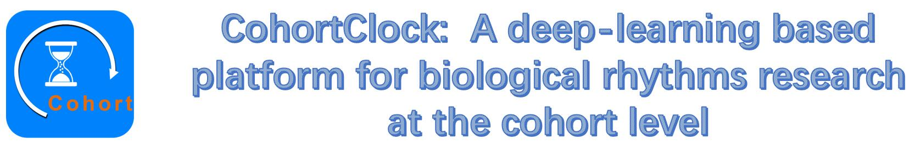
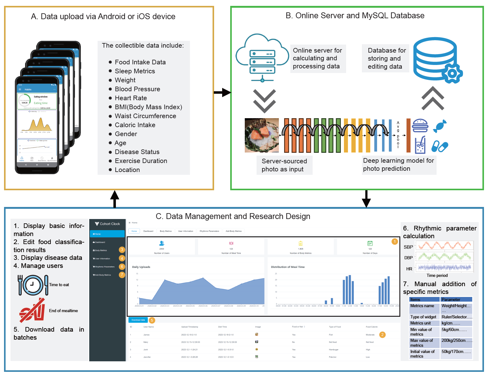

### CohortClock, a platform which capitalizes on smartphone technology and artificial intelligence algorithms to facilitate the collection and management of large-scale rhythmic behavior data. This platform is cross-compatible, seamlessly integrating with both Android (developed using Java) and iOS systems (developed using Swift), thereby ensuring broad accessibility to collect data and transmit it to the server. The server collects data using a MySQL database, and frontend web-based data management is achieved through the use of Flask and Vue. &nbsp;&nbsp;&nbsp;&nbsp;&nbsp;&nbsp;

DietClock has three components containing client side, server side and administration side. (A) Client side, With Android version and Ios version, it can collect the user's eating time and pictures, and collect other physical indicators such as height, weight, sleep time, sleep quality, hunger level, mood change and water intake. (B) Server side, the user data transmitted by the client can be received and the deep learning model can be invoked for food picture classification and time-restricted diet model adaptation. (C) Administration side, can extract user data from the server side, analyze, calculate and modify it, and also carry out experimental design of time-restricted diet.

## Mobile app download and demo address
* Android: 

* IOS: Since IOS cannot install untested software at will, and our app is not currently on the app store, we have released our beta software on TestLight, Apple's officially recommended software testing platform. If you'd like to install our IOS software, email the same email you used to register for AppleID to chiyuhao2018@sibs.ac.cn. We'll add you to our list of testers, and you'll be able to download our app on TestLight.

* HTML administration page:

* Linux web server

<video src="https://github.com/WangLab-SINH/CohortClock/assets/87359159/62377bc0-db6f-4d8c-b62e-ceae2b9f1802"></video>
https://github.com/WangLab-SINH/CohortClock/assets/87359159/62377bc0-db6f-4d8c-b62e-ceae2b9f1802

