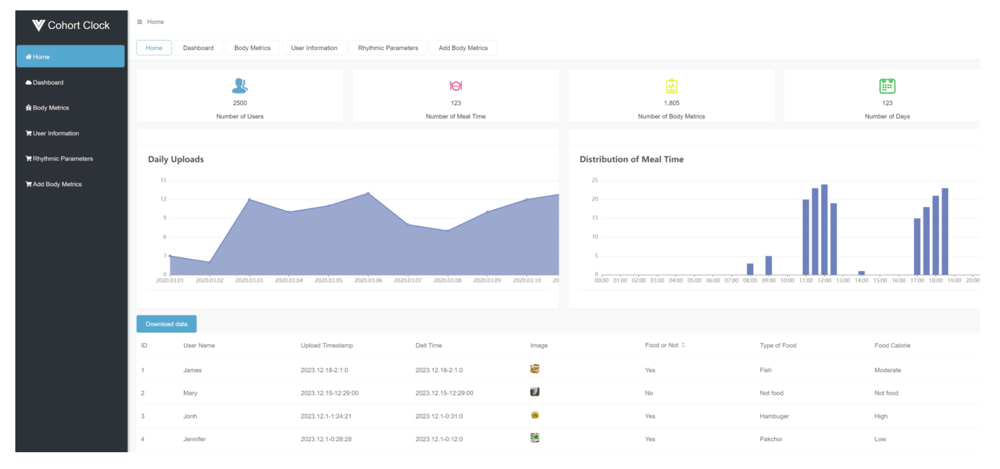

### CohortClock, a platform which capitalizes on smartphone technology and artificial intelligence algorithms to facilitate the collection and management of large-scale rhythmic behavior data. This platform is cross-compatible, seamlessly integrating with both Android (developed using Java) and iOS systems (developed using Swift), thereby ensuring broad accessibility to collect data and transmit it to the server. The server collects data using a MySQL database, and frontend web-based data management is achieved through the use of Flask and Vue. &nbsp;&nbsp;&nbsp;&nbsp;&nbsp;&nbsp;

CohortClock has three components containing client side, server side and administration side. (A) Client side, With Android version and Ios version, it can collect the user's eating time and pictures, and collect other physical indicators such as height, weight, sleep time, sleep quality, hunger level, mood change and water intake. (B) Server side, the user data transmitted by the client can be received and the deep learning model can be invoked for food picture classification and time-restricted diet model adaptation. (C) Administration side, can extract user data from the server side, analyze, calculate and modify it, and also carry out experimental design of time-restricted diet.

## Mobile app download and demo address
* Android:   [Android version download site](https://github.com/WangLab-SINH/CohortClock/raw/main/app-release.apk)

* IOS: Due to the restrictions on installing untested software on iOS, and as our application is not currently available on the App Store, we have released our beta version on the official Apple-recommended software testing platform, TestFlight. If you would like to install our iOS version, please send the email associated with your registered Apple ID to chiyuhao2018@sibs.ac.cn. We will add you to the list of testers, and you will then be able to download our application on TestFlight.

* HTML administration page: http://39.100.73.118:3001/

* Linux web server: Server image On Alibaba Cloud, the image id of the server is m-8vbevtc05ettdvrph0pa, you can load this image in Alibaba Cloud server, also, the server image can be downloaded from:

## Introduction
### Android/IOS client side
The client mobile applications for both Android and iOS display dietary time recommendations based on the user's uploaded meal times, calculated to align with the user's dietary habits. Beneath the dietary recommendations in the dietary mode, users can view a probability density distribution graph of their dietary habits within a 24-hour time period. This graphical representation allows users to intuitively observe their own dietary patterns. Additionally, we have designed an image upload interface that enables users to choose photos from their albums or take new pictures by clicking the camera button. The images, compressed for efficiency, are synchronized with the upload timestamp and transmitted to the server for computation and storage. In case users forget to upload pictures during meals, they can click the "select time" button to manually choose the mealtime and upload corresponding images.

An example for uploading photos from android app.
<video src="https://github.com/WangLab-SINH/CohortClock/assets/87359159/62377bc0-db6f-4d8c-b62e-ceae2b9f1802"></video>

In addition to dietary images and meal times, we can also collect other body metrics related to time-restricted eating, such as weight and sleep duration, for correlation analysis with time-restricted eating patterns. Users can also modify and delete uploaded images, annotated weight information, and sleep duration information directly on the client application.

### Administration side
This tool provides a streamlined interface for managing user data received from the server. Researchers can design experiments and group users on the administrator page. Administrators have access to each user's submitted dietary times and image information. This functionality empowers researchers to analyze data and gain insights into patterns of dietary intake timing.

By aggregating and analyzing the collected data, researchers can identify common trends and patterns, offering valuable insights for future research and interventions. Basic statistical features within the administrator interface allow for simple data exploration, providing an initial overview of the collected data. Researchers can examine indicators such as meal frequency, time distribution, food group composition, weight changes, sleep quality, and more to discover associations and correlations.

## Requirements
### Android
* Android Studio version 3.6.3
* SDK version 28
* Java version 1.8
* Detailed package version [versions.gradle](https://github.com/WangLab-SINH/CohortClock/blob/main/Android/versions.gradle)
  
Application Framework Construction: We utilize XUI (https://github.com/xuexiangjys/XUI) as the overall framework for the application. XUI is an open-source UI framework that offers rich templates as references for the interface framework. The advantage of using a unified UI framework is that it ensures consistent design styles across various interfaces within the mobile application. The flexible layout for the overall pages employs the FlexboxLayout framework provided by Google (https://github.com/google/flexbox-layout), allowing the software interface to adapt to screens of different sizes and proportions. Each page in the application belongs to an open-source XPageFragment class constructed based on Fragment (https://github.com/xuexiangjys/XPage), facilitating smooth page sliding, navigation, and data interaction. The data transfer between different interfaces in the application utilizes the open-source MMKV component (https://github.com/Tencent/MMKV), an efficient key-value pair transmission component for cross-page data transfer.

Statistical Analysis of User Dietary Times and Implementation of Dietary Time Recommendation Page: To conveniently display the time points when users upload their dietary information and provide dietary time recommendations, we constructed an HTML page based on ECharts 3.0.0.2 version within the mobile application. ECharts is used to draw cumulative distribution charts and heat maps. The Android application is provided with a web environment and framework using the AgentWeb library (https://github.com/Justson/AgentWeb).

Implementation of Food Image Capture and Selection Page: We employ the user-friendly image selector framework PictureSelector (https://github.com/LuckSiege/PictureSelector) for capturing, operations, and uploads of images. Images are compressed when uploaded to the server to save bandwidth and server resources. We convert images to Bitmap format and compress them.

Implementation of Mobile Database: To allow users to quickly access the historical records of their uploaded data, it is essential to build a local database for storing data. Therefore, we use the SQLite framework on the Android platform for data storage, access, and modification.

### IOS
* Xcode version 15.0.1
* Swift version 5
* IOS version >14.0

Application Framework Construction: We use SnapKit (https://github.com/SnapKit/SnapKit) as the overall framework for the application. SnapKit is an open-source UI framework that provides rich templates as references for the interface framework. The advantage of using a unified UI framework is that it ensures consistent design styles across various interfaces within the mobile application. The data transfer between different interfaces in the application utilizes the open-source MMKV component (https://github.com/Tencent/MMKV), an efficient key-value pair transmission component for cross-page data transfer, which can also be used in the iOS version.

Statistical Analysis of User Dietary Times and Implementation of Dietary Time Recommendation Page: To conveniently display the time points when users upload their dietary information and provide dietary time recommendations, we constructed an HTML page based on ECharts 3.0.0.2 version within the mobile application. ECharts is used to draw cumulative distribution charts and heat maps.

Implementation of Food Image Capture and Selection Page: We use the open-source framework for the iOS system, LXPhotosManagerModule (https://github.com/LIXIANGXLee/LXPhotosManagerModule), for capturing, operations, and uploads of food images.

Implementation of Mobile Database: To allow users to quickly access the historical records of their uploaded data, it is essential to build a local database for storing data. Therefore, we use the FMDB database for the iOS platform (https://github.com/ccgus/fmdb) for data storage.

###Server
* Python version 3.7.4
* Python package version can be obtained from 

